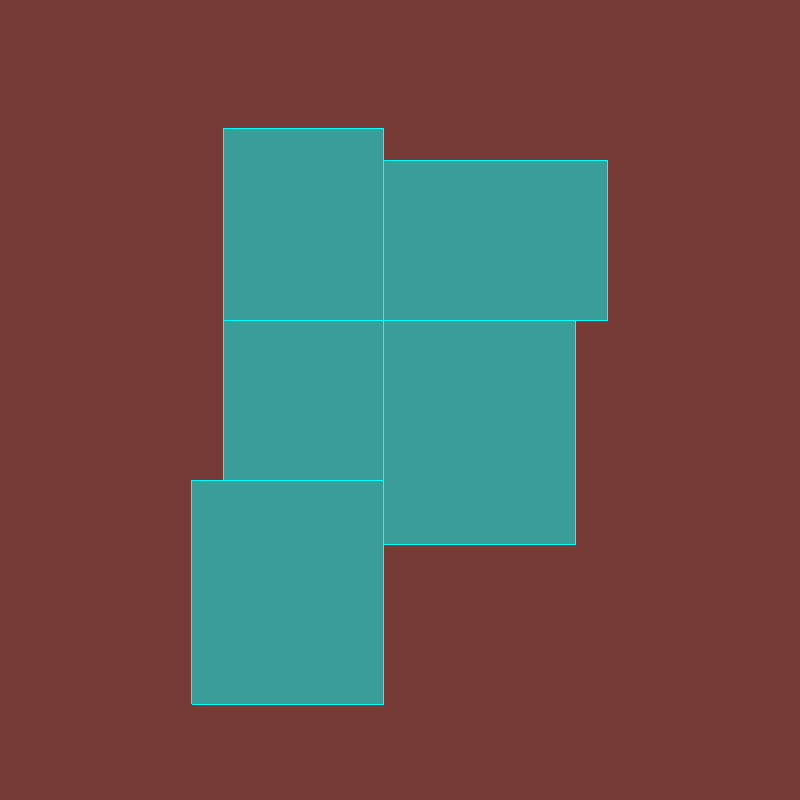
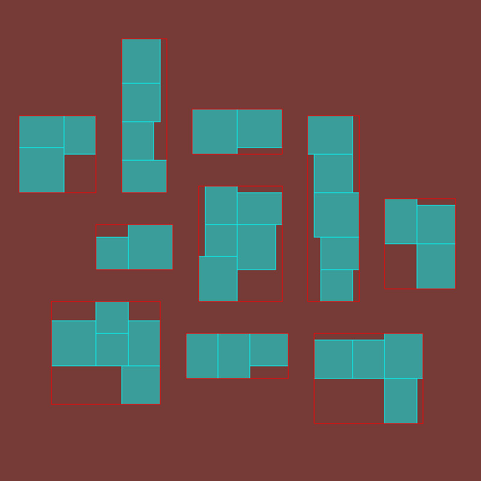
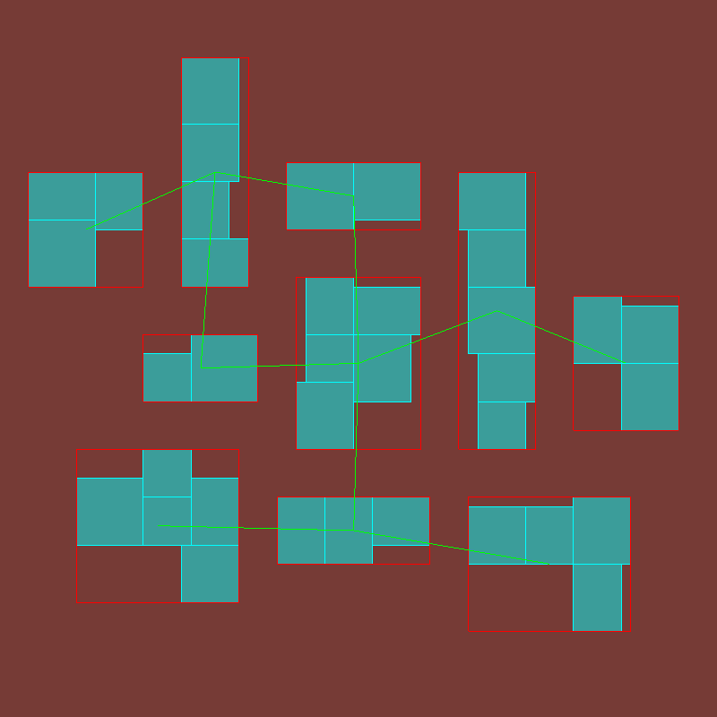
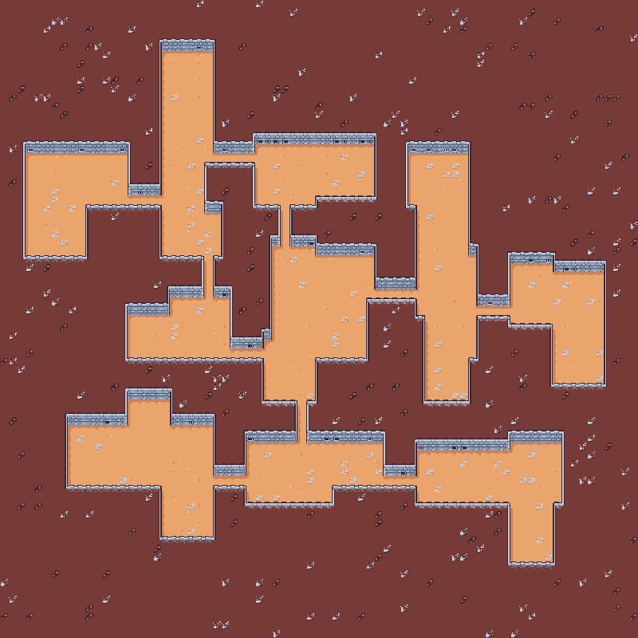

# DungeonGenerator

This is a tile-based dungeon generator made with [MAGE](https://github.com/SenneDeVocht/mage), with some player controls to explore.

### Step 1: generating a room
A room is generated by starting with one rectangle. Rectangles are then added to free sides.

### Step 2: placing a room
After the room is generated, it needs to be placed in the dungeon. It will be placed at closest position to the center where it can fit.
To see if rooms can fit, only their boundaries are considered, to limit the calculation time.

Rooms are placed this way until the desired amount is reached.

### Step 3: connecting the rooms
To connect rooms first all possible connections are calculated. Rooms can only connect to the rooms closest by.
When we have all possible connections, we can reduce them to just the minimum spanning tree. And finaly, we allow a few of the connections not in the tree to be included, so there are some cyclical paths.

### Step 4: choosing start and exit
The start and end position are a determined amount of rooms away from eachother. To choose them, the distances between all pairs of rooms are calculated. Then a pair that is far enough apart gets chosen at random.

### Step 5: drawing the dungeon
Finaly we need to choose the right tiles to put onto the tilemap. This is done by a simple ruleset that looks at each tile's neighbours.

